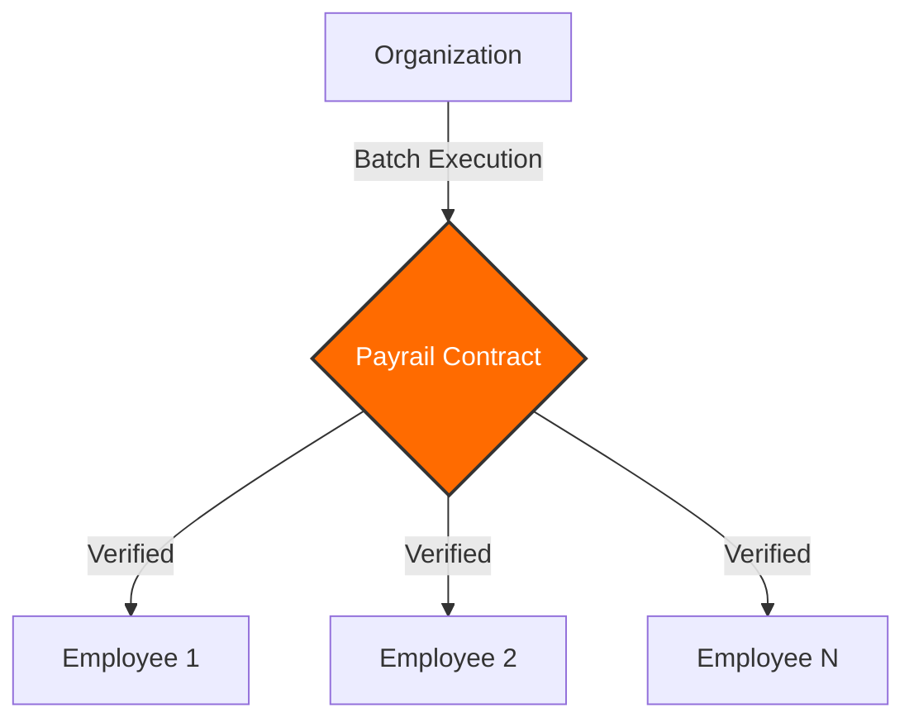

# Payrail

---

<p align="center">
  
</p>

> _The Decentralized Payroll Engine & The Future of Non-Custodial Workforce Payments_

<p align="center">
  
  
  
  
  
</p>

**Problem:** Custodial Risk & Global Payment Friction. **Solution:** A Non-custodial, Atomic Payroll Protocol on Stacks.

**Payrail** bridges the gap between traditional business management and the Bitcoin economy. It allows organizations to execute high-volume payroll with instant settlement and 100% financial sovereignty. By leveraging the **Batch Payment Protocol**, Payrail turns a manual, error-prone task into a single, secure, and verifiable on-chain event.

---

## 💡 Innovation: The Atomic Batching Engine

Payrail introduces a native blockchain optimization for workforce management. Unlike standard transfers that drain gas and time, Payrail bundles your entire payroll into a single **Atomic Transaction**.

- **Zero Counterparty Risk**: Funds move directly from your wallet to your team.
- **Smart Contract Verified**: Every payment is governed by the `payrail.clar` contract.
- **Micro-Fee Optimization**: Pay up to **20 people** for the price of one network transaction.

---

## 🏗️ Technical Architecture

Payrail uses a high-performance stack to ensure the dashboard remains reactive even handles complex blockchain states.



### Full-Stack Breakdown

- **Frontend**: Next.js 15, Tailwind CSS v4, Framer Motion.
- **Blockchain**: Clarity (Stacks L2), Leather/Hiro Wallet Integration.
- **Infrastructure**: Supabase (Metadata), Resend (Notifications).
- **Security**: Stacks Post-Conditions (Asset Protection).

---

## 🚀 Installation & Setup

### Prerequisites

- [Node.js v20+](https://nodejs.org/)
- [Leather Wallet](https://leather.io/)

### Quick Start

```bash
# Clone and install
git clone https://github.com/Wutche/payrail.git
cd payrail && npm install

# Configure your environment
cp .env.example .env.local

# Launch the engine
npm run dev
```

---

## 🏆 The Payrail Advantage

- **For Owners**: Absolute control. No bank freezes, no middleman fees.
- **For Teams**: Instant liquidity. Get paid in Bitcoin-backed STX.
- **For the Ecosystem**: Scaling financial activity on the Bitcoin layer.

---

## 📄 License

MIT License © 2026 Payrail Foundation.

---

_Built for the next generation of decentralized workforces._
